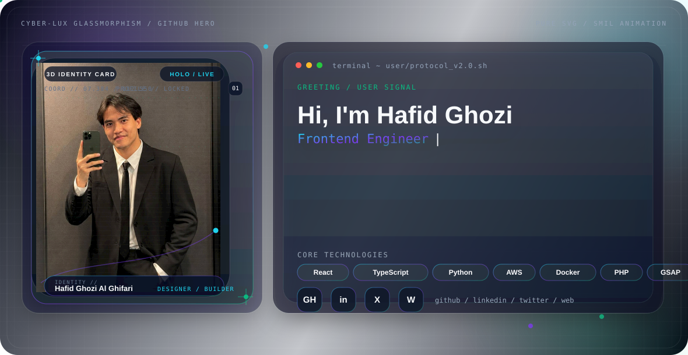
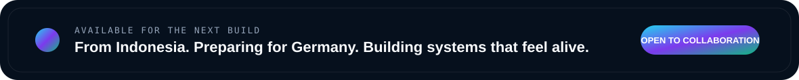

<picture>
  <source media="(prefers-color-scheme: dark)" srcset="./assets/dark.webp">
  <source media="(prefers-color-scheme: light)" srcset="./assets/light.webp">
  
</picture>

<div align="center">
  <a href="https://ghozitech.github.io/"><b>PORTFOLIO</b></a>
  &nbsp;•&nbsp;
  <a href="https://github.com/GhoziTech"><b>GITHUB</b></a>
  &nbsp;•&nbsp;
  <a href="mailto:hafidghozii01@gmail.com"><b>EMAIL</b></a>
  &nbsp;•&nbsp;
  <a href="https://www.instagram.com/hafidghozi.ai/"><b>INSTAGRAM</b></a>
  &nbsp;•&nbsp;
  <a href="https://wa.me/6285727688928"><b>WHATSAPP</b></a>
</div>

<br>

## About me

I am **Hafid Ghozi Al Ghifari**, a creative frontend developer and automation builder from **Surakarta, Indonesia**. I design interactive interfaces, practical workflows, and digital products that combine visual precision with usable engineering.

My current vector is **Germany**: strengthening **Deutsch B2**, preparing for an **Ausbildung in 2026**, and building a professional portfolio around frontend engineering, AI-assisted automation, and interactive systems.

<picture>
  <source media="(prefers-color-scheme: dark)" srcset="./assets/capability-dark.png">
  <source media="(prefers-color-scheme: light)" srcset="./assets/capability-light.png">
  
</picture>

## Selected projects

<table>
<tr>
<td width="50%" valign="top">

### [Identity Reactor — 3D Portfolio](https://ghozitech.github.io/)
A cinematic portfolio built with React, TypeScript, Three.js, GSAP, and responsive interaction systems.

`React` `Three.js` `GSAP` `Personal Brand`

</td>
<td width="50%" valign="top">

### [Motionverse AI](https://github.com/GhoziTech/motionverse)
A browser-based motion game platform focused on camera interaction, gesture input, and responsive gameplay.

`Computer Vision` `Interactive Games` `Web Camera` `UX`

</td>
</tr>
<tr>
<td width="50%" valign="top">

### [GhoziTech WhatsApp Bot](https://github.com/GhoziTech/bot-wa)
A product-ordering automation system with stock management, account workflows, and business logic.

`Node.js` `Automation` `Baileys` `Business Logic`

</td>
<td width="50%" valign="top">

### [Padel Elite](https://padel-elite.lovable.app/)
A premium sports website concept built around booking, membership, coaching, and conversion-focused presentation.

`Premium UI` `Responsive Web` `Sports Brand` `Booking UX`

</td>
</tr>
<tr>
<td width="50%" valign="top">

### [Velvet Noir](https://velvetnoir-luxury.lovable.app/)
A cinematic hospitality concept combining luxury nightlife branding, atmosphere, and reservation-focused navigation.

`Luxury UI` `Hospitality` `Landing Page` `Conversion`

</td>
<td width="50%" valign="top">

### German Learning Systems
Educational game and training concepts spanning A1–C2, combining progression systems, survival mechanics, and language practice.

`EdTech` `Game Systems` `German A1–C2` `Product Design`

</td>
</tr>
</table>

## Current focus

```yaml
profile:
  name: Hafid Ghozi Al Ghifari
  location: Surakarta, Indonesia
  languages: Deutsch B2 · Indonesian Native · English Working

focus:
  - creative frontend engineering
  - AI-assisted automation
  - interactive learning experiences
  - production-ready web delivery

status: Open to collaboration and Ausbildung opportunities for 2026
```

<picture>
  <source media="(prefers-color-scheme: dark)" srcset="./assets/cta-dark.png">
  <source media="(prefers-color-scheme: light)" srcset="./assets/cta-light.png">
  
</picture>

<div align="center">
  <b>Build clearly. Animate intentionally. Ship professionally.</b>
</div>
