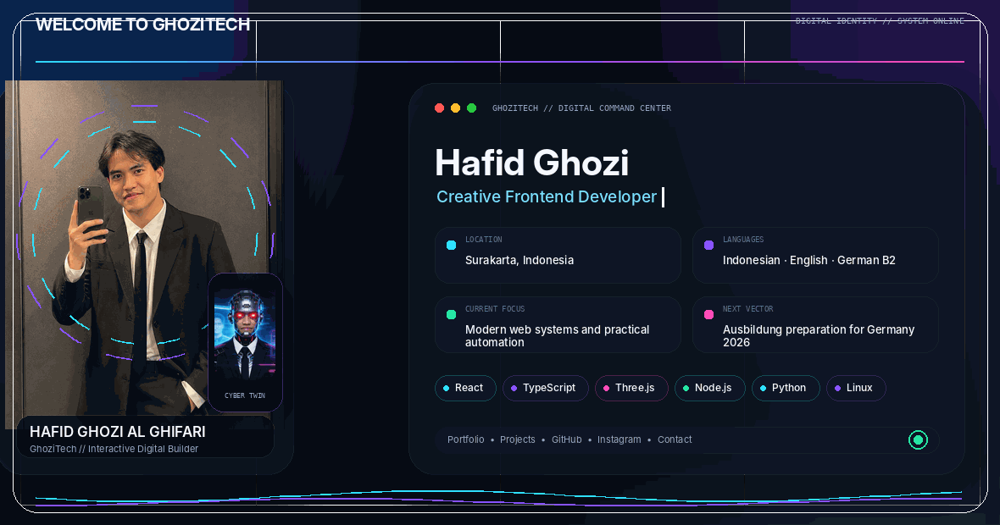
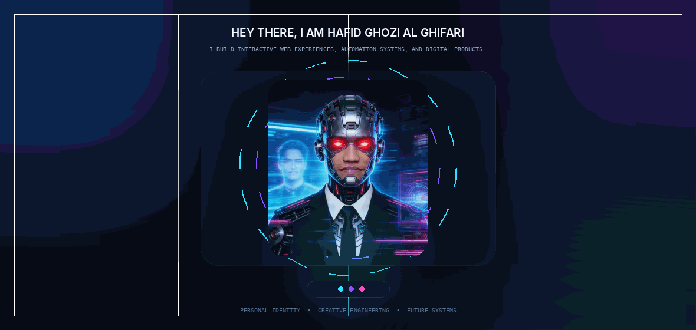
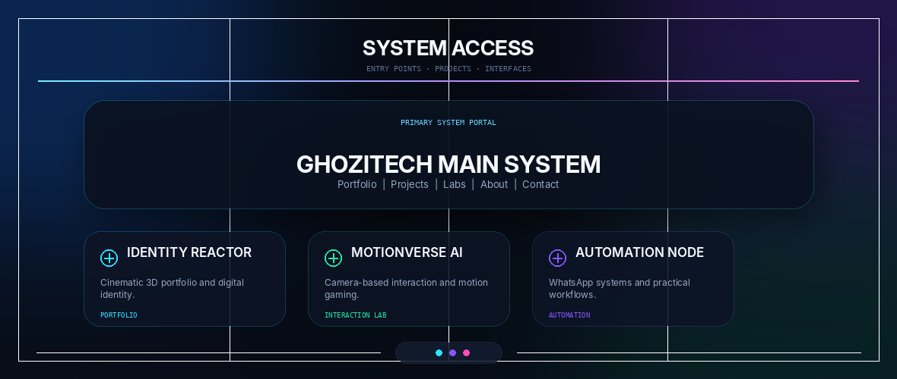
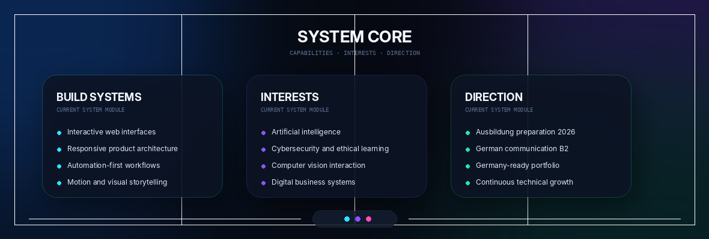
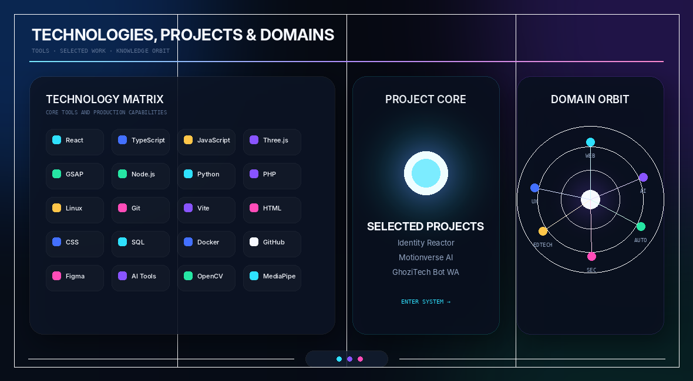
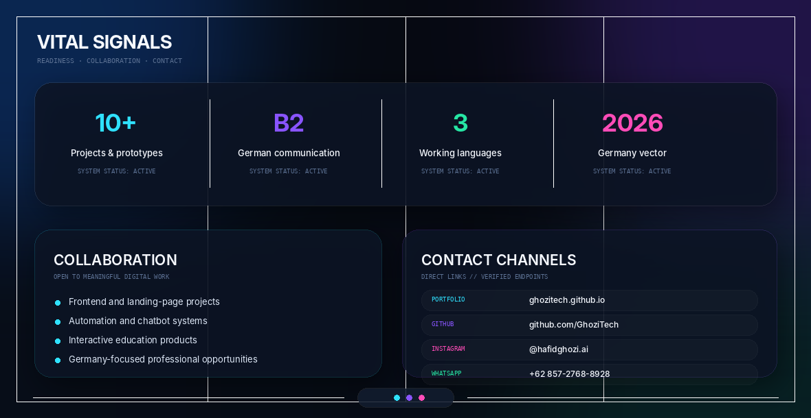
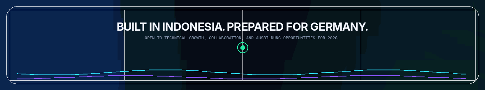

  

 

  <a href="https://ghozitech.github.io/"><strong>PORTFOLIO</strong></a>
  &nbsp;&nbsp;·&nbsp;&nbsp;
  <a href="https://github.com/GhoziTech"><strong>GITHUB</strong></a>
  &nbsp;&nbsp;·&nbsp;&nbsp;
  <a href="https://instagram.com/hafidghozi.ai"><strong>INSTAGRAM</strong></a>
  &nbsp;&nbsp;·&nbsp;&nbsp;
  <a href="https://wa.me/6285727688928"><strong>WHATSAPP</strong></a>

 

  

  

  

  

  

  

