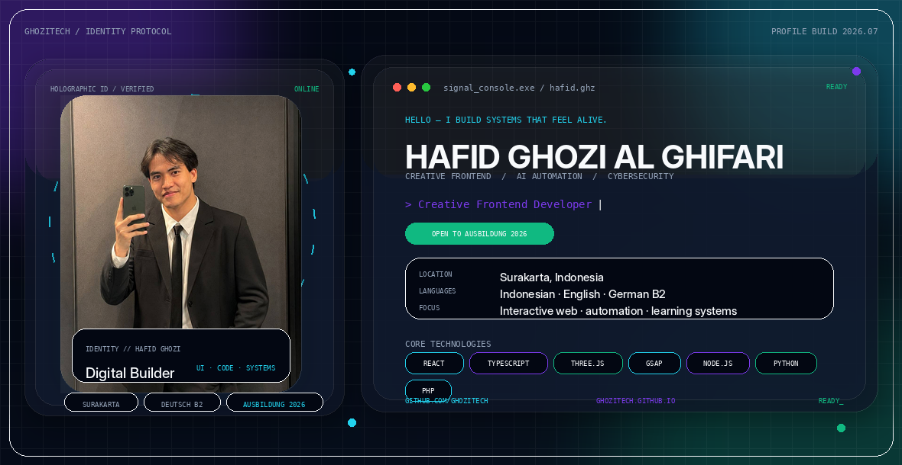
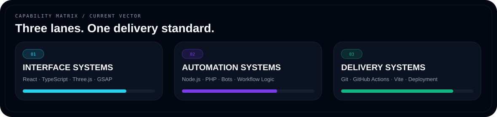
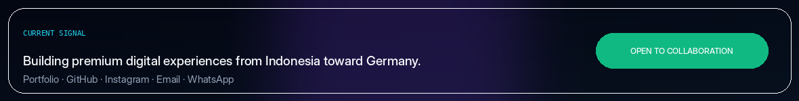

<picture>
  <source media="(prefers-color-scheme: dark)" srcset="./assets/hero-dark.gif">
  <source media="(prefers-color-scheme: light)" srcset="./assets/hero-light.gif">
  
</picture>

<div align="center">
  <a href="https://ghozitech.github.io/"><b>PORTFOLIO</b></a>
  &nbsp;·&nbsp;
  <a href="https://github.com/GhoziTech"><b>GITHUB</b></a>
  &nbsp;·&nbsp;
  <a href="https://www.instagram.com/hafidghozi.ai/"><b>INSTAGRAM</b></a>
  &nbsp;·&nbsp;
  <a href="mailto:hafidghozii01@gmail.com"><b>EMAIL</b></a>
  &nbsp;·&nbsp;
  <a href="https://wa.me/6285727688928"><b>WHATSAPP</b></a>
</div>

<br>

## About me

I am **Hafid Ghozi Al Ghifari**, a digital builder from **Surakarta, Indonesia**. I create interactive web experiences, practical automation, and product concepts that combine clear logic with strong visual direction.

My current vector connects **creative frontend engineering**, **AI-assisted automation**, **cybersecurity learning**, and preparation for an **Ausbildung in Germany in 2026**. I communicate in Indonesian, English, and German (**B2**).

<picture>
  <source media="(prefers-color-scheme: dark)" srcset="./assets/capability-dark.png">
  <source media="(prefers-color-scheme: light)" srcset="./assets/capability-light.png">
  
</picture>

## Selected projects

<table>
<tr>
<td width="50%" valign="top">

### [Identity Reactor — 3D Portfolio](https://ghozitech.github.io/)
A cinematic personal portfolio built around motion, 3D presentation, responsive interaction, and deliberate storytelling.

`React` `TypeScript` `Three.js` `GSAP`

</td>
<td width="50%" valign="top">

### [Motionverse AI](https://github.com/GhoziTech/motionverse)
A camera-controlled browser game portal focused on hand tracking, movement input, and accessible interaction design.

`Computer Vision` `Web Games` `Interaction UX`

</td>
</tr>
<tr>
<td width="50%" valign="top">

### [GhoziTech WhatsApp Bot](https://github.com/GhoziTech/bot-wa)
A business automation system with product workflows, inventory logic, account handling, and deployment support.

`Node.js` `Automation` `Baileys` `Business Logic`

</td>
<td width="50%" valign="top">

### [Padel Elite](https://padel-elite.lovable.app/)
A premium sports-club concept focused on membership, booking, coaching, and high-conversion presentation.

`Premium UI` `Responsive Web` `Booking UX`

</td>
</tr>
<tr>
<td width="50%" valign="top">

### [Velvet Noir](https://velvetnoir-luxury.lovable.app/)
A cinematic hospitality website combining luxury branding, atmosphere, and reservation-focused navigation.

`Luxury UI` `Hospitality` `Conversion`

</td>
<td width="50%" valign="top">

### German Learning Systems
Educational game and training concepts spanning A1–C2 with progression, survival mechanics, and structured language practice.

`EdTech` `German A1–C2` `Game Systems`

</td>
</tr>
</table>

## Current stack

```text
Frontend     → React, TypeScript, GSAP, Three.js
Automation   → Node.js, PHP, Python, workflow logic
Tools        → Git, GitHub Actions, Docker, Vite
Languages    → Indonesian, English, German B2
Goal         → Ausbildung 2026 / production-ready digital products
```

<picture>
  <source media="(prefers-color-scheme: dark)" srcset="./assets/footer-dark.png">
  <source media="(prefers-color-scheme: light)" srcset="./assets/footer-light.png">
  
</picture>
