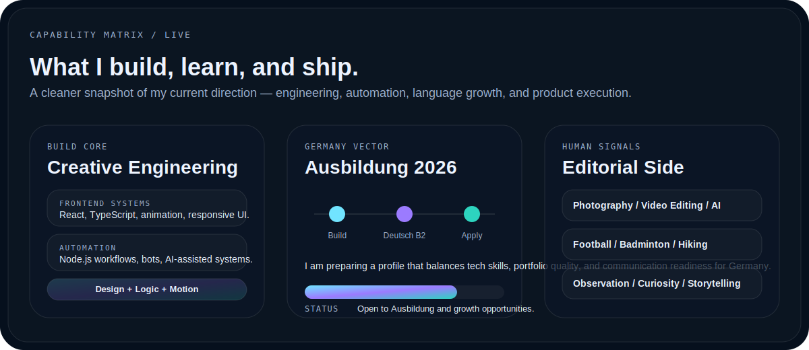

<picture>
  <source media="(prefers-color-scheme: dark)" srcset="./assets/ghozitech-hero-dark.svg">
  <source media="(prefers-color-scheme: light)" srcset="./assets/ghozitech-hero-light.svg">
  
</picture>

<div align="center">
  <a href="https://ghozitech.github.io/"><b>ENTER PORTFOLIO</b></a>
  &nbsp;·&nbsp;
  <a href="mailto:hafidghozii01@gmail.com"><b>START A CONVERSATION</b></a>
  &nbsp;·&nbsp;
  <a href="https://www.instagram.com/hafidghozi.ai/"><b>FOLLOW THE BUILD LOG</b></a>
</div>

<br>

## The signal

I am **Hafid Ghozi Al Ghifari**, a creative frontend developer and AI automation builder from Surakarta, Indonesia. I build interactive interfaces, practical automation, and digital learning systems—then ship them as usable products.

My current vector is Germany: **Deutsch B2**, preparing for an **Ausbildung in 2026**, and expanding a portfolio that connects web engineering, AI, automation, and interactive experiences.

<picture>
  <source media="(prefers-color-scheme: dark)" srcset="./assets/capability-matrix-dark.svg">
  <source media="(prefers-color-scheme: light)" srcset="./assets/capability-matrix-light.svg">
  
</picture>

## Selected deployments

<table>
<tr>
<td width="50%" valign="top">

### [Identity Reactor — 3D Portfolio](https://ghozitech.github.io/)
A cinematic portfolio built with React, TypeScript, Three.js, GSAP, and a responsive interaction system.

`3D Web` `Creative Frontend` `Motion` `Personal Brand`

</td>
<td width="50%" valign="top">

### [Motionverse AI](https://github.com/GhoziTech/motionverse)
A camera-controlled game portal focused on hand tracking, motion interaction, and responsive browser gameplay.

`Computer Vision` `Interactive Games` `Web Camera` `UX`

</td>
</tr>
<tr>
<td width="50%" valign="top">

### [GhoziTech WhatsApp Bot](https://github.com/GhoziTech/bot-wa)
A product-ordering and account workflow bot with stock management, automated purchase logic, and deployment tooling.

`Node.js` `Automation` `Baileys` `Business Logic`

</td>
<td width="50%" valign="top">

### [Padel Elite](https://padel-elite.lovable.app/)
A premium sports-club website concept built around membership, booking, coaching, and conversion-focused presentation.

`Premium UI` `Responsive Web` `Sports Brand` `Booking UX`

</td>
</tr>
<tr>
<td width="50%" valign="top">

### [Velvet Noir](https://velvetnoir-luxury.lovable.app/)
A cinematic hospitality concept combining luxury nightlife branding, atmosphere, and reservation-focused navigation.

`Hospitality` `Cinematic UI` `Luxury Brand` `Conversion`

</td>
<td width="50%" valign="top">

### German Learning Systems
Educational game and training concepts spanning A1–C2, combining progression, survival mechanics, and language practice.

`EdTech` `Game Systems` `German A1–C2` `Product Design`

</td>
</tr>
</table>


## Operating principles

```text
01  CLARITY BEFORE COMPLEXITY      → every interaction needs a reason
02  MOTION WITH FUNCTION           → animation must guide, not distract
03  BUILD FOR REAL DEVICES         → desktop polish is not enough
04  AUTOMATE REPEATED WORK         → systems should remove friction
05  SHIP, TEST, REFINE             → working software beats vague ideas
```

## Current transmission

```yaml
focus:
  - creative frontend engineering
  - AI-assisted automation
  - interactive learning experiences
  - production-ready web delivery

languages:
  German: B2
  Indonesian: Native
  English: Working knowledge

status: "Open to collaboration and Ausbildung opportunities for 2026"
```

<div align="center">
  <b>From Indonesia. Built for Germany. Designed to move.</b><br><br>
  <a href="https://github.com/GhoziTech">GitHub</a> ·
  <a href="https://ghozitech.github.io/">Portfolio</a> ·
  <a href="mailto:hafidghozii01@gmail.com">Email</a> ·
  <a href="https://wa.me/6285727688928">WhatsApp</a> ·
  <a href="https://www.instagram.com/hafidghozi.ai/">Instagram</a>
</div>
